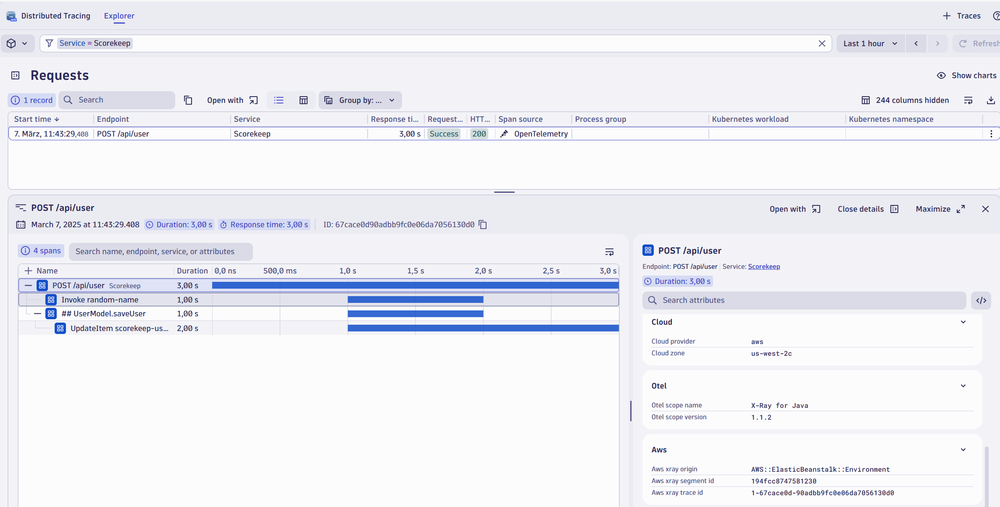

# AWS X-Ray Exporter for OpenTelemetry

This project allows to read trace telemetry (segment documents) pulled from AWS X-Ray REST-Api and convert/forward to an OpenTelemetry OTLP compatible endpoint. 

It enables an observability solution to analyze the trace telemetry directly captured via e.g. OpenTelemetry together with X-Ray instrumented AWS services. Especially for fully managed (serverless) services such as Amazon API Gateway, which ONLY [support tracing using X-Ray](https://docs.aws.amazon.com/apigateway/latest/developerguide/apigateway-enabling-xray.html), the integration of X-Ray gives much better insights and end-2-end visibility. 

### Original Trace in X-Ray


### Trace exported into [Dynatrace](http://www.dynatrace.com)


### Trace correlation 
As AWS X-Ray uses its proprietary trace-context, a transaction which passes multiple tracing systems such as X-Ray and OpenTelemetry (using W3C-TraceContext), will generate separated traces. To follow such a transaction you need to correlate the traces by capturing the trace-context from the incoming different tracing system. This concept is also called *span-linking*. 

### Logs in context of traces
AWS services with X-Ray enabled contain the X-Ray trace id's within their log events. You can either look up the logs by the origin AWS X-Ray tracecontext, which is included as span attributes (```aws.xray.trace.id``` and ```aws.xray.segement.id```) or you transform the X-Ray trace-context on the log-events into the W3C trace-context as used by the the conversion in XRay22OTLP. 

Wheras the span-id is derived from the segment-id without any further modification, the trace-id is converted using the logic ```SUBSTR(REPLACE_STRING(traceId, "-", ""), 1))```

An example of such a a log processing rule using Dynatrace is
```
PARSE(content, "JSON{STRING:traceId}(flat=true)")
| PARSE(content, "JSON{STRING:segmentId}(flat=true)")
| FIELDS_ADD(dt.trace_id:SUBSTR(REPLACE_STRING(traceId, "-", ""), 1))
| FIELDS_REMOVE(traceId)
| FIELDS_RENAME(dt.span_id: segmentId)
```
for structured logs or  
```
PARSE(content, "DATA 'XRAY TraceId:' SPACE? STRING:TraceId DATA 'SegmentId:' SPACE? STRING:SegmentId")
| FIELDS_ADD(TraceId,SegmentId)
| FIELDS_ADD(dt.trace_id:SUBSTR(REPLACE_STRING(TraceId, "-", ""), 1))
| FIELDS_REMOVE(TraceId)
| FIELDS_RENAME(dt.span_id: SegmentId)
```
for unstructured logs. 

## How does it work?

XRayConnector implements the workflow for polling from the [AWS X-Ray REST-Api](https://docs.aws.amazon.com/xray/latest/devguide/xray-api-gettingdata.html), does the data transformation and forwarding to an OpenTelemetry OTLP compatible endpoint. The data-transformation semantics converting from AWS X-Ray segment documents to OTLP is implemented in the XRay2OTLP library. 

XRayConnector provides a [REST Api](#rest-api) to manage the workflow.

The **supported OpenTelemetry protocol** is [OTLP/HTTP JSON format](https://opentelemetry.io/docs/reference/specification/protocol/otlp/#otlphttp)

### Scalability & Portability
The workflow is implemented using [Durable Functions](https://learn.microsoft.com/en-us/azure/azure-functions/durable/durable-functions-overview?tabs=in-process%2Cv3-model%2Cv1-model&pivots=csharp), which abstracts away the complexity to manage a fault-tolerant and reliable polling mechanism as behind the scenes the framework manages state, checkpoints, and automatic restarts.  

Durable Functions are powered by the [Durable Task Framework (DTFx)](https://github.com/Azure/durabletask), which supports an extensible set of backend persistense stores. For this project the DurableTask.SqlServer extension is used to provide a cross-platform deployment using Kubernetes.

 For more details about the architecture, scaling and operations using the SQLServer extension on K8s [read here](https://microsoft.github.io/durabletask-mssql/)

 #### AWS X-Ray API-Limits
 The AWS X-Ray REST Api is subject to throttling when the rate limit of 5 requests per second is reached. This limits the total number of traces beeing exported. The required number of requests for a number of traces can be estimated with the following formula:

 ````(NumberOfTraces * (1 + 20*RoundUp(AvgNumberofServicesPerTrace/10)))/100````

Throttled requests are logged to the console as Warnings. 

## Getting Started

### Pre-Requisites
For reading from the AWS X-Ray REST Api, [create an AWS access key](https://docs.aws.amazon.com/powershell/latest/userguide/pstools-appendix-sign-up.html) with a policy that includes at least following actions ```xray:BatchGetTraces``` and ```xray:GetTraceSummaries```.

### Deploy to K8s 

#### Default configuration 
The default configuration uses a **polling interval** of **5 minutes** to retrieve recent traces. 

The XRayConnector pod is configured to use up to 5 workers, which should be sufficient to run the workflow in most scenarios, but it is recommended to test under load conditions. You should consider scaling out workers if your database tables ```dt.NevEvents``` or ```dt.NewTasks```start queuing up unprocessed events. 

THe database is deployed using a stateful-set with 8Gib storage. As DTFx is based on the event-sourcing pattern, the database can grow very fast.

It is recommended to regularly purge the history of executed workflow runs. **purgehistory.yml** covers a cronjob which calls the  [/api/PurgeHistory](#purge-workflow-history) **every day at 2am**. Depending on the number of traces to export and database scale configuration, you may choose a much higher purge frequency. 

The xrayconnector.yml includes a watchdog-cronjob that automatically calls [/api/WorkflowWatchdog](#check-status-of-the-workflow) to check the status of the workflow **every 3 minutes**. 

#### Step-by-Step Guide
**Step 1)** Build the XRayConnector container and push it to your target repository
```
# Replace '<YOUR-REPOSITORY>' with your target container registry
docker build -t xrayconnector:latest -f ./xrayconnector/Dockerfile .
docker tag xrayconnector:latest <YOUR-REPOSITORY>/xrayconnector:latest
docker push <YOUR-REPOSITORY>/xrayconnector:latest
```
**Step 2)** Make sure KEDA v2 is up and running

For more details how to install KEDA, [see](https://keda.sh/docs/2.15/deploy/)

**Step 3)** Configure database mssql-statefulset-secrets.yml

Replace PLACEHOLDER with your password of choice to access the database.

**Step 4)** Deploy mssql server and create the database
```
kubectl create namespace mssql
kubectl apply -f ./mssql-statefulset-secrets.yml -n mssql
kubectl apply -f ./mssql-statefulset.yml -n mssql

# Once pod is ready...
# ..get the name of the Pod running SQL Server
$mssqlPod = kubectl get pods -n mssql -o jsonpath='{.items[0].metadata.name}'

# Use sqlcmd.exe to create a database named "DurableDB". 
# Replace 'PLACEHOLDER' with the password you used earlier
$mssqlPwd = "PLACEHOLDER"
kubectl exec -n mssql $mssqlPod -- /opt/mssql-tools18/bin/sqlcmd -C -S . -U sa -P $mssqlPwd -Q "CREATE DATABASE [DurableDB] COLLATE Latin1_General_100_BIN2_UTF8"

# (Optionally)Deploy a cronjob to purge the history of executed workflow runs.
# Prior configure the purgehistory.yml to your needs
# kubectl -f ./purgehistory.yml
```

**Step 5)** Configure the polling & fowarding of X-Ray data in connector-config.yml

Replace the placeholders with proper values providing AWS secrets, OTLP endpoints, ..
```
...
  # # # REPLACE placeholders!!! # # # 
  # Database connection string, replace the <YOUR-DATABASE-PASSWORD> with your actual password as configured in mssql-statefulset-secrets.yml
  SQLDB_Connection: "Server=mssqlinst.mssql.svc.cluster.local;Database=DurableDB;User ID=sa;Password=<YOUR-DATABASE-PASSWORD>;Persist Security Info=False;TrustServerCertificate=True;Encrypt=True;"
  # For Dynatrace provide the OTLP endpoint which may look like this: "https://<YOUR-TENANT-ID>.live.dynatrace.com/api/v2/otlp/v1/traces"
  OTLP_ENDPOINT: "<YOUR-OTLP-TARGET-ENDPOINT>"
  # For Dynatrace provide a API Token with OTLP Trace Ingest permissions in the following format "Api-Token <YOUR-DYNATRACE-API-TOKEN>"
  OTLP_HEADER_AUTHORIZATION: "<YOUR-OPTIONAL-OTLP-HEADER-AUTHORIZATION>"
  # Role based access
  AWS_RoleArn: "<YOUR-ROLE-ARN>",
  # https://docs.aws.amazon.com/general/latest/gr/xray.html#xray_region
  # us-east-1, ap-southeast-2, etc.
  AWS_RegionEndpoint: "<YOUR-AWS-REGION>"
  # Provide credentials if not using role based access
  #AWS_IdentityKey: "<YOUR-AWS-IDENTITY-KEY>"
  #AWS_SecretKey: "<YOUR-AWS-SECRET-KEY>"
  # Polling intervall for retrieving trace-summaries
  PollingIntervalSeconds: "300"  
  # If set to True the workflow is automatically started (or re-started in case it was terminated or failed) when the api/WorkflowWatchdog is called
  AutoStart: "True"
```

**Step 6)** Configure the function keys & registry in xrayconnector.yml

* (Recommended) Replace all function keys ( host.master, host.function.default, ..), which protect your functions with new ones, encoded in base64. 
    * Generate a new key with e.g. OpenSSL: ```openssl rand -base64 32```
    * Base64 encode the returned key: ```echo -n '<THE NEW KEY>' | base64```
* (Recommended) Replace the host.masterkey used in the xrayconnector-watchdog cronjob ```http://xrayconnector/api/WorkflowWatchdog?code=<REPLACE-WITH-THE-NEW-KEY>``` with the newly created key. 
* Replace &lt;YOUR-REPOSITORY&gt; with the container registry, hosting your image

**Step 7)** Deploy config and XRayConnector
```
kubectl apply -f .\connector-config.yml
kubectl apply -f .\xrayconnector.yml

#check deployment status
kubectl get pods
kubectl rollout status deployment xrayconnector
```

### REST Api

See ```test.http``` which provides api requests to be run in Visual Studio Code (VSCode) via the [REST Client extension](https://marketplace.visualstudio.com/items?itemName=humao.rest-client).

#### Manually start the workflow
If autostart is disabled, you need to automatically trigger the main workflow timer.

```POST https://xxxx/api/TriggerPeriodicAPIPoller?code=<YOUR-FUNCTION-HOST-MASTER-KEY>```

#### Terminate the workflow
Manually stop the workflow. 

```POST https://xxxx/api/TerminatePeriodicAPIPoller?code=<YOUR-FUNCTION-HOST-MASTER-KEY>```

#### Check status of the workflow
Checks the status of the workflow. If autostart is enabled, enforces a start of the workflow. 

```POST https://xxxx/api/WorkflowWatchdog?code=<YOUR-FUNCTION-HOST-MASTER-KEY>```

#### Purge workflow history
Purges the workflow history for instances older than X minutes. Default is 1 day if not provided within content. 

```
POST https://xxxx/api/PurgeHistory?code=<YOUR-FUNCTION-HOST-MASTER-KEY>
content-type: text/plain

360
```

#### Test API 
A simple endpoint to see if the api is up & running

```GET https://xxxx/api/TestPing?code=<YOUR-FUNCTION-HOST-MASTER-KEY>```

#### Ingest a sample trace into X-Ray for testing 
Sends a sample trace into X-Ray. This feature requires additional actions granted in your AWS IAM policy: ```xray:PutTelemetryRecords``` and ```xray:PutTraceSegments```

```POST https://xxxx/api/TestGenerateSampleTrace?code=<YOUR-FUNCTION-HOST-MASTER-KEY>``` 

#### Send a sample trace to the backend 
Sends a sample trace to the configured OTLP endpoint to validate connection settings. 

```POST https://xxxx/api/TestSendSampleTrace?code=<YOUR-FUNCTION-HOST-MASTER-KEY>``` 


## Release Notes
* v1.4 Add new function endpoint and cronjob to purge database history
* v1.3 Improve resilience 
    * Operate mssql as a statefulset
    * Improved logging of XRayCLient issues
    
  BREAKING CHANGES
    * New YAML files for the mssql database. See updated instructions.  
    * Merged mssql-secrets.yml into connector-config.yml. Requires update of the xrayconnector.yml
* v1.2 Update attribute mapping 
    * Incorporate xray segment error into span status 
* v1.1 Add *TestSendSampleTrace* api to validate OTLP connectivity
* v1.0 Switch to K8s deployment as the default option. 

  BREAKING CHANGES: 
  * XRayConnector and XRayConnectorContainerized projects have been merged. To build the container image for K8s deployment, all references to *XRayConnectorContainerized* have been migrated to *XRayConnector*. Please also see the adapted instructions in **Deploy to K8s, Step 1**. 
* v0.11 Add supoprt to automatically start the workflow

  BREAKING CHANGES: 
  * By default the workflow is now automatically started via a cronjob. Can be disabled via connector-config.yml, setting AutoStart to "False"
* v0.10 Added support for role assumption via AWS STS. Added new config option to define polling interval in seconds.
* v0.9 Added a new project XRayConnectorContainerized +  manifest for k8s deployment
* v0.8 Add mapping for SQS, SNS, DynamoDB and Links
* v0.6 Add mappings for ApiGateway and Lambda
* v0.5 Initial release 

## Contribute
This is an open source project, and we gladly accept new contributions and contributors.  

## License
Licensed under Apache 2.0 license. See [LICENSE](LICENSE) for details.
