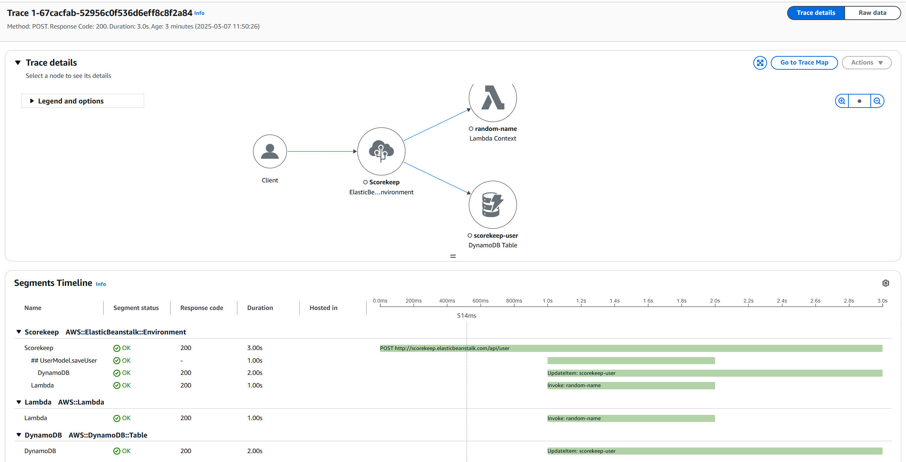
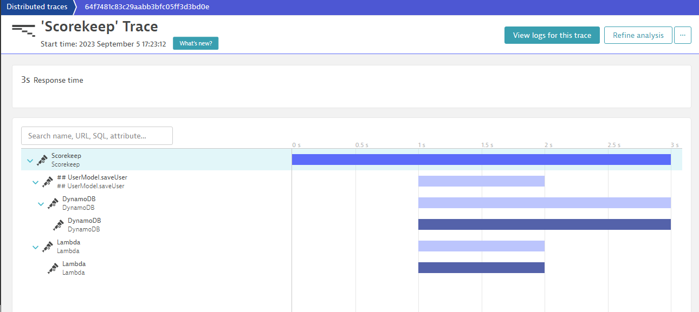
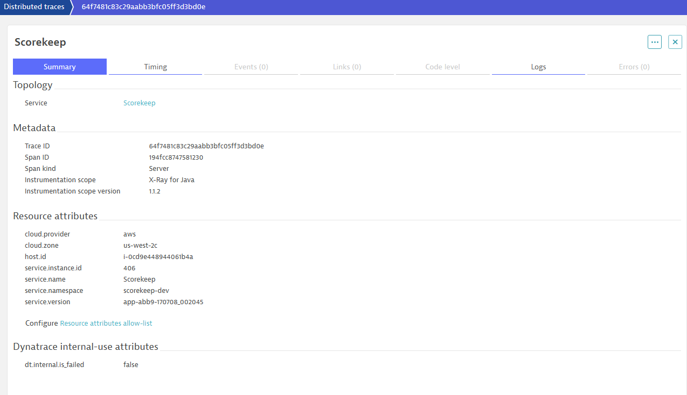

# AWS X-Ray Exporter for OpenTelemetry

This project allows to read trace telemetry (segment documents) pulled from AWS X-Ray REST-Api and convert/forward to an OpenTelemetry OTLP compatible endpoint. 

It enables an observability solution to analyze the trace telemetry directly captured via e.g. OpenTelemetry together with X-Ray instrumented AWS services. Especially for fully managed (serverless) services such as Amazon API Gateway, which ONLY [support tracing using X-Ray](https://docs.aws.amazon.com/apigateway/latest/developerguide/apigateway-enabling-xray.html), the integration of X-Ray gives much better insights and end-2-end visibility. 

### What about trace correlation 
As AWS X-Ray only supports its proprietary trace-context, a transaction which passes multiple tracing systems such as X-Ray and OpenTelemetry (using W3C-TraceContext), will generate separated traces. To follow such a transaction you need to correlate the traces by capturing the trace-context from the incoming different tracing system. This concept is also called *span-linking*. 

## How does it work?

The solution contains 2 projects: 
#### XRay2OTLP
XRayOTLP is a library to convert AWS X-Ray segment documents into the OpenTelemetry format OTLP. 

#### XRayConnector
XRayConnector implements the polling logic for the AWS X-Ray REST-Api: https://docs.aws.amazon.com/xray/latest/devguide/xray-api-gettingdata.html. The logic is implemented using [Azure Durable Function](https://learn.microsoft.com/en-us/azure/azure-functions/durable/durable-functions-overview?tabs=in-process%2Cv3-model%2Cv1-model&pivots=csharp) framework, which abstracts away the complexity to manage a fault-tolerant and reliable polling mechanism as behind the scenes the framework manages state, checkpoints, and automatic restarts. 

It can be deployed either on Azure Functions or as well in Kubernetes (K8s), which makes it suitable to be deployed directly in AWS. For more details on using Azure Durable Functions in Kubernetes see [here](https://microsoft.github.io/durabletask-mssql/#/kubernetes). 

The **polling interval** to retrieve recent traces is **5 minutes**. A timer triggered function automatically starts the polling. 

The **supported OpenTelemetry protocol** is [OTLP/HTTP JSON format](https://opentelemetry.io/docs/reference/specification/protocol/otlp/#otlphttp)

If you want to implement a similar fault-tolerant REST Api-Poller using AWS serverless services, you can get started [here](https://github.com/aws-samples/sam-api-poller)

## Getting Started

### Pre-Requisites
For reading from the AWS X-Ray REST Api, [create an AWS access key](https://docs.aws.amazon.com/powershell/latest/userguide/pstools-appendix-sign-up.html) with a policy that includes at least following actions ```xray:BatchGetTraces``` and ```xray:GetTraceSummaries```.

### Running locally
For details how to run an Azure Function locally see [Code and test Azure Functions locally](https://learn.microsoft.com/en-us/azure/azure-functions/functions-develop-local)

Configure the AWS access key in your *local.settings.json* 
```
{
    "IsEncrypted": false,
    "Values": {
        "AzureWebJobsStorage": "UseDevelopmentStorage=true",
        "FUNCTIONS_WORKER_RUNTIME": "dotnet",
        "OTLP_HEADER_AUTHORIZATION": "<YOUR-OPTIONAL-OTLP-HEADER-AUTHORIZATION>",
        "OTLP_ENDPOINT": "<YOUR-OTLP-TARGET-ENDPOINT>",
        "AWS_IdentityKey": "<YOUR-AWS-IDENTITY-KEY>",
        "AWS_SecretKey": "<YOUR-AWS-SECRET-KEY>"
    }
}

```
and provide additional configuration required on your OTLP endpoint you want to send the traces to.

### Sending a sample trace for testing
The service includes an endpoint ```/TestGenerateSampleTrace```, which sends a sample trace into X-Ray. This feature requires additional actions granted in your AWS IAM policy: ```xray:PutTelemetryRecords``` and ```xray:PutTraceSegments```

### Original Trace in X-Ray


### Trace exported into [Dynatrace](http://www.dynatrace.com)


## Release Notes
v0.5 Initial release 

## Contribute
This is an open source project, and we gladly accept new contributions and contributors.  

## License
Licensed under Apache 2.0 license. See [LICENSE](LICENSE) for details.

